# ComfyUI-Prediction-Boost
Modify noise prediction to make image brighter on Stable Diffusion.
This is a custom node for ComfyUI.

# Method
We use xₜ⊥Ɛ̃(the vector component of xₜ perpendicular to Ɛ̃) to boost up the image part of xₜ by this:

Ɛ̃ ← Ɛ̃ - boost_scale * (xₜ⊥Ɛ̃)

# Result
- model: Animagine XL V3.1<https://civitai.com/models/260267/animagine-xl-v31>
- seed: 42
- steps: 20
- cfg: 5.0
- sampler: uni_pc
- scheduler: normal
- negative prompt: flat design, early sketch, PTSD, stain, signature

- prompt: original, "the aquarium girl"

prompt: original, "the aquarium girl"
||||||
| --- | --- | --- | --- | --- |
| boost=0.0 |  |  |  | [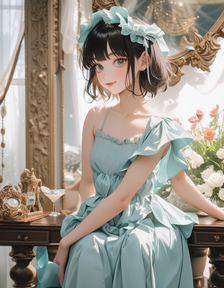](samples/ComfyUI_00899_.png) |
| boost=0.15 |  |  | [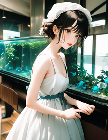](samples/ComfyUI_00922_.png) | [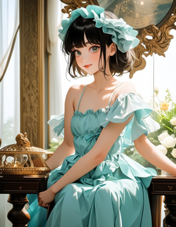](samples/ComfyUI_00923_.png) |

prompt: original, "the rainy days"
||||||
| --- | --- | --- | --- | --- |
| boost=0.0 |  |  | [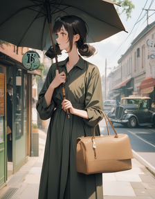](samples/ComfyUI_00902_.png) |  |
| boost=0.15 |  |  |  |  |

prompt: original, "botanical cafe"
||||||
| --- | --- | --- | --- | --- |
| boost=0.0 | [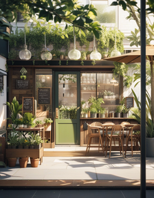](samples/ComfyUI_00904_.png) | [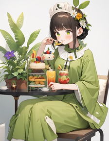](samples/ComfyUI_00905_.png) | [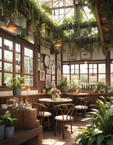](samples/ComfyUI_00906_.png) | [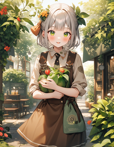](samples/ComfyUI_00907_.png) |
| boost=0.15 | [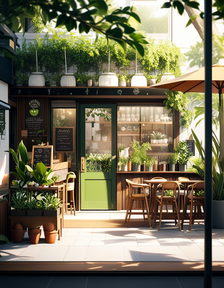](samples/ComfyUI_00928_.png) | [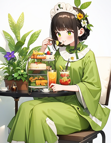](samples/ComfyUI_00929_.png) | [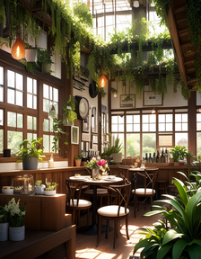](samples/ComfyUI_00930_.png) | [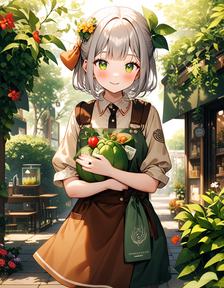](samples/ComfyUI_00931_.png) |

prompt: original, "across the shore"
||||||
| --- | --- | --- | --- | --- |
| boost=0.0 |  |  |  |  |
| boost=0.15 |  |  |  | [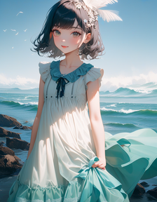](samples/ComfyUI_00935_.png) |

prompt: original, "the two of us"
||||||
| --- | --- | --- | --- | --- |
| boost=0.0 |  | [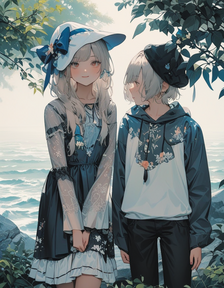](samples/ComfyUI_00913_.png) | [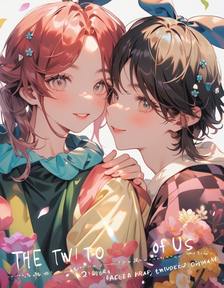](samples/ComfyUI_00914_.png) | [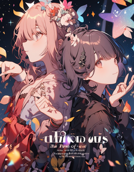](samples/ComfyUI_00915_.png) |
| boost=0.15 |  | [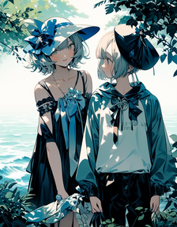](samples/ComfyUI_00937_.png) | [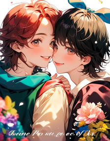](samples/ComfyUI_00938_.png) | [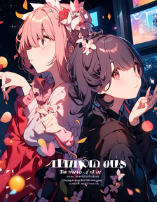](samples/ComfyUI_00939_.png) |