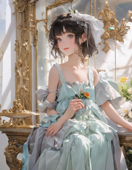
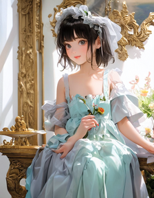
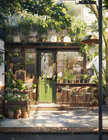
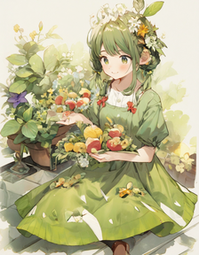
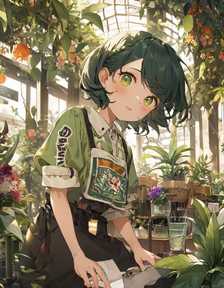
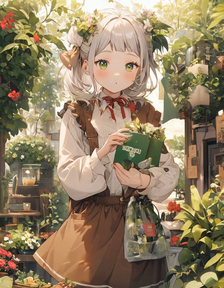
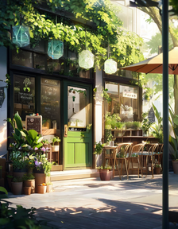
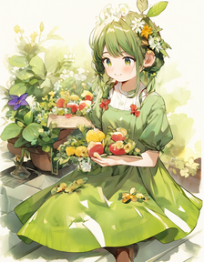
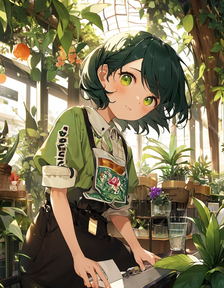
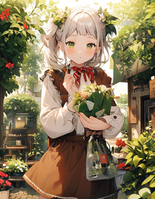

# ComfyUI-Prediction-Boost
Modify noise prediction to make image brighter on Stable Diffusion.
This is a custom node for ComfyUI.

# Method
We use xₜ⊥Ɛ̃(the vector component of xₜ perpendicular to Ɛ̃) to boost up the image part of xₜ by this:

Ɛ̃ ← Ɛ̃ - boost_scale * (xₜ⊥Ɛ̃)

# Result
- model: Animagine XL V3.1<https://civitai.com/models/260267/animagine-xl-v31>
- seed: 42
- steps: 25
- cfg: 3.0
- sampler: dpmpp_2m
- scheduler: karras
- negative prompt: flat design, early sketch, PTSD, stain, signature

- prompt: original, "the aquarium girl"

||||||
| --- | --- | --- | --- | --- |
| boost=0.0 |  |  |  |  |
| boost=0.1 |  |  |  |  |

- prompt: original, "the rainy days"

||||||
| --- | --- | --- | --- | --- |
| boost=0.0 |  |  |  |  |
| boost=0.1 |  |  |  |  |

- prompt: original, "botanical cafe"

||||||
| --- | --- | --- | --- | --- |
| boost=0.0 |  |  |  |  |
| boost=0.1 |  |  |  |  |

- prompt: original, "across the shore"

||||||
| --- | --- | --- | --- | --- |
| boost=0.0 |  |  |  |  |
| boost=0.1 |  |  |  |  |

